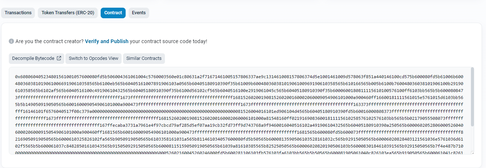
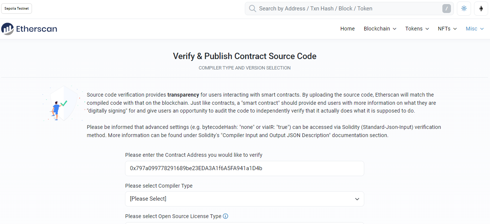
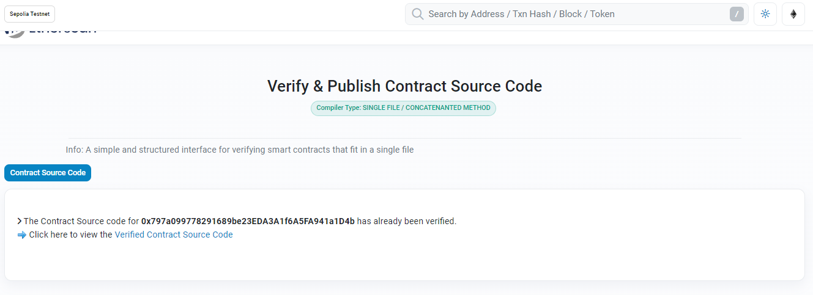

# ECommerce Web3 🛒🌐

### Table of Contents

-   [Title](#ecommerce-web3-🛒🌐)
-   [Description](#description)
-   [Population](#population)
-   [Subgraphs](#subgraphs)
-   [Verification of Contract Code](#verification-of-contract-code)

## Description

This project demonstrates a basic E-commerce platform that allows verified Merchants to create products, edit and delete product(s) and allows customers to access available products and make purchase. Users can be verified as Merchants only by the validation of the Admin.

## Population

Navigate to [create Products script](./populate/createProducts.js) and append more products by following product format below.

```js
{
    _name: "<<PRODUCT-NAME>>",
    _description: "<<PRODUCT-DESCRIPTION>>",
    _price: ethers.parseEther("0.0002")
}
```

## Subgraphs

-   [ECommerce](https://)
-   [UserRegistry](https://)

## Verification of Contract code

As depicted from [Etherscan](https://sepolia.etherscan.io/)



<div id="center">
    <p>Verify & Publish</p>
</div>



<div id="center">
    <p>Verify & Publish Form</p>
</div>


